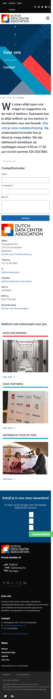
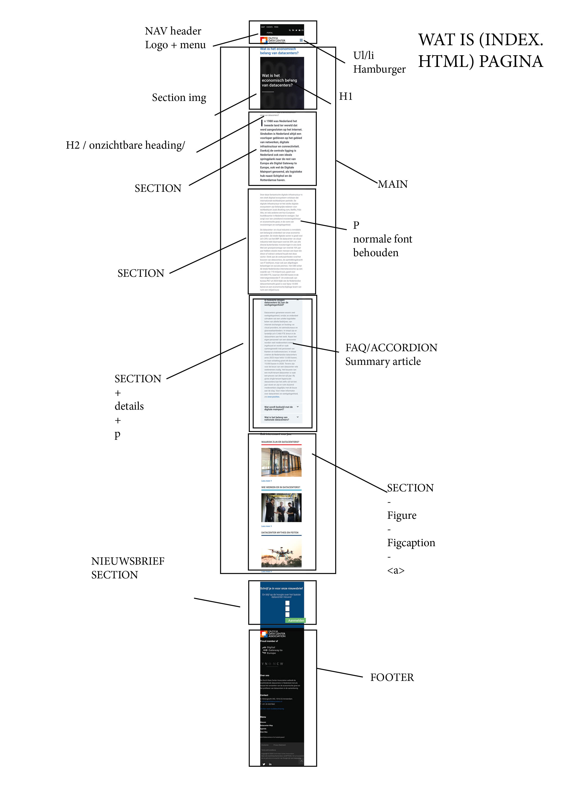
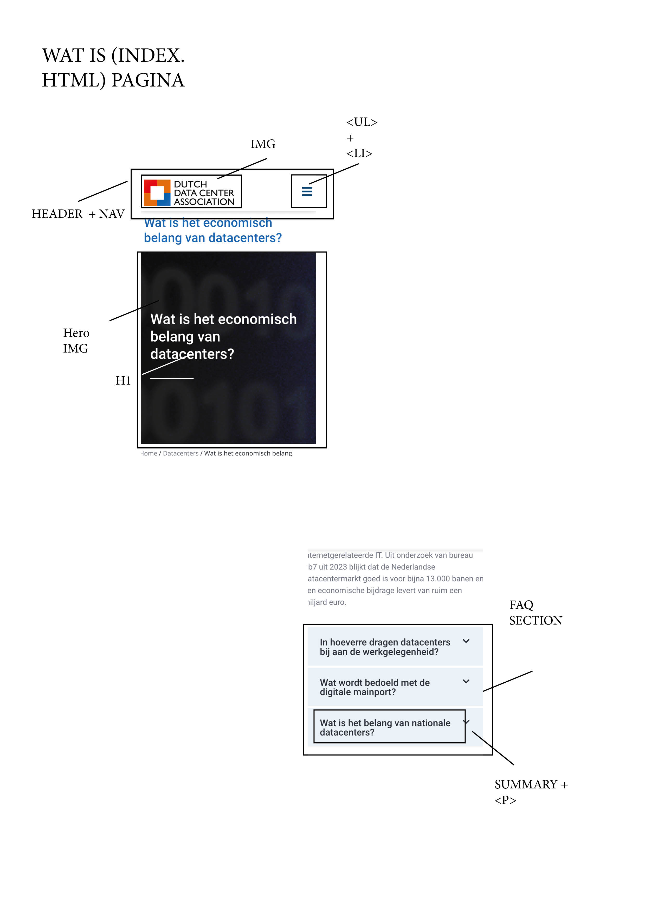
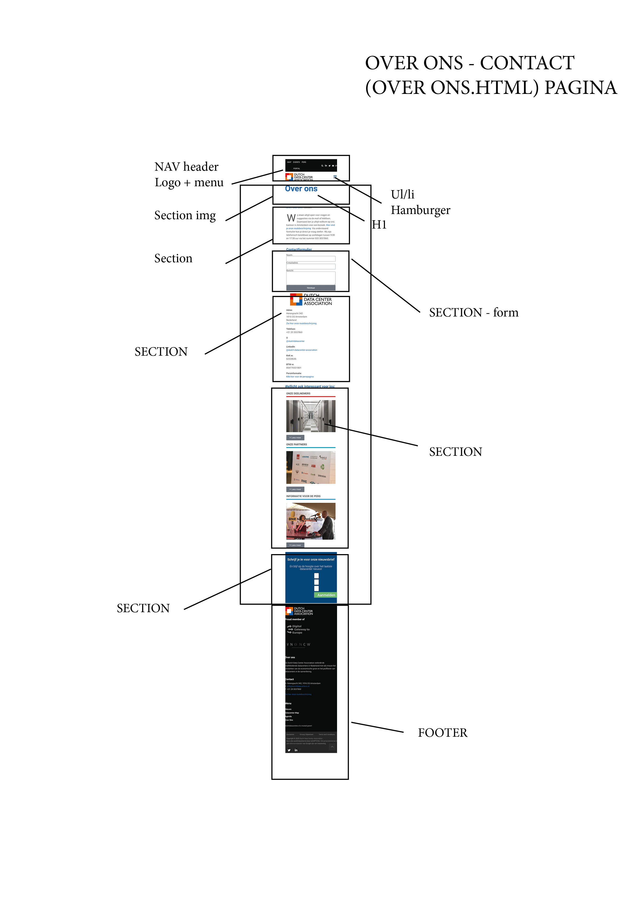
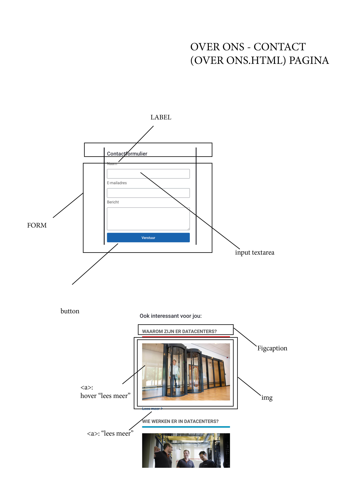

# Procesverslag
Markdown is een simpele manier om HTML te schrijven.  
Markdown cheat cheet: [Hulp bij het schrijven van Markdown](https://github.com/adam-p/markdown-here/wiki/Markdown-Cheatsheet).

Nb. De standaardstructuur en de spartaanse opmaak van de README.md zijn helemaal prima. Het gaat om de inhoud van je procesverslag. Besteedt de tijd voor pracht en praal aan je website.

Nb. Door *open* toe te voegen aan een *details* element kun je deze standaard open zetten. Fijn om dat steeds voor de relevante stuk(ken) te doen.

## Jij

  
uitwerken voor kick-off werkgroep

  ### Auteur:
 Tijn Gerhards

  #### Je startniveau:
   blauw

  #### Je focus:
   surface plane
 

## Je website

  
uitwerken voor kick-off werkgroep

  ### Je opdracht:
Belangen: https://www.dutchdatacenters.nl/datacenters/wat-is-economisch-belang-datacenters/

Contact: https://www.dutchdatacenters.nl/over-ons/contact/

  #### Screenshot(s) van de eerste pagina (small screen): 
  hier de naam van de pagina  
  

  #### Screenshot(s) van de tweede pagina (small screen):
  hier de naam van de pagina  
  
  

## Toegankelijkheidstest 1/2 (week 1)

  
uitwerken na test in 2e werkgroep

  
  
  ### Bevindingen
  Lijst met je bevindingen die in de test naar voren kwamen: 
  - De screenreader kan afbeeldingen niet lezen.
  - De screenreader pakt geanimeerde inlopende tekst niet.
  
  #### Screenreader
  Het doorlopen van de website met screenreader ging niet helemaal lekker. 
  Hij las veel dingen voor op de site die overbodig zouden zijn voor de persoon die gebruikt maakt van de screenreader zoals het vertellen van welk tekstelement je bent. 
  Verder kan de screenreader ook de tekst over afbeeldingen niet lezen en mijn site maakt hier veel gebruik van en dus mis je zo veel belangrijk informatie. 

  #### Muis en Toetsenbord 
  Hier heb ik verder niet heelveel op aan te merken.
  De site is met de muis en het toetsenbord makkelijk te besturen. 
  Alleen wordt de cursor op de site wel anders (vormgeving van de wrebsite zelf)

  #### Motoriek (shocks, elastiekjes)
  Door de elastiekjes kon ik vrijwel niet door de website navigeren. 
  Dingen zoals buttons clicken of naar beneden scrollen waren vrijwel niet te doen.

  #### Visueel (brillen, contrast, kleurenblind, dark/light). 
  Ookal was het beeld met de brillen op wat moeilijker te zien, kon ik mij nogsteeds vrij gemakkelijk door de site navigeren en kon ik de meeste dingen van mijn website nogwel gemakkelijk zien. 
  Dit komt waarschijnlijk door het duidelijke en goeie gebruik van verschillende kleuren op mijn site die zorgen voor een goed contrast.

## Breakdownschets (week 1)

  
uitwerken na afloop 3e werkgroep

  ### Pagina 1: 
  

  ### dynamisch deel (Accordeon / nav/menu): 
  

  --------

  ### Pagina 1: 
  

  ### dynamisch deel (Form / figures - figcaption): 
  

## Voortgang 1 (week 2)

  
uitwerken voor 1e voortgang

### Stand van zaken
  hier dit ging goed & dit was lastig
  
Dit ging goed
- Het opzetten van de basisstructuur in HTML en het toepassen van CSS ging goed.
- Ik kreeg de website visueel al redelijk overeenkomend met het voorbeeld.
- Ik begon te begrijpen hoe HTML en CSS samenwerken op mijn website.

Dit ging niet goed - Enters in mijn website tekst krijgen ( maakte gebruik van
element en dat is praktisch niet overzichtelijk en handig voor het functioneren van je website). 
Verder had ik nog niet een goeie verdeling staan van de verschillende sections waaruit mijn website bestaat. 
Ook had ik gebruik gemaakt van classes en dat was niet bedoeling van de opdracht.

### Agenda voor meeting
  samen met je groepje opstellen

student 1 (ik)	HTML-structuur & semantiek
student 2	CSS selectors
student 3	Nth-of-type
student 4	CSS Diner / algemene feedback

  ### Verslag van meeting
  hier na afloop snel de uitkomsten van de meeting vastleggen

 - Advies gekregen om   niet te gebruiken voor layout.
 - Feedback gekregen om meer met HTML-structuur en minder met classes te werken.
 - Introductie gekregen in nth-of-type selectors.

## Voortgang 2 (week 3)

  
uitwerken voor 2e voortgang

  ### Stand van zaken
Dit ging goed
- De website is volledig mobile first opgebouwd.
- CSS is opgeschoond en maakt geen gebruik meer van classes.
- Navigatie werkt met JavaScript en is toegankelijk (aria-expanded, hidden).

Dit ging lastig
- Formuliervalidatie was nog niet duidelijk zichtbaar voor de gebruiker.

  ### Agenda voor meeting
student 1 (ik)	Gebruik/ indeling sections en semntiek
student 2	...
student 3	Mobile first aanpak
student 4	Accessibility

  ### Verslag van meeting
  hier na afloop snel de uitkomsten van de meeting vastleggen

  - In elke section moet een heading staan.
  - Voeg visuele feedback toe bij formulieren (:valid en :invalid).
  - Je gebruikt nu een section binnen je footer, dat is niet nodig/verplicht.

## Toegankelijkheidstest 2/2 (week 4)

 
uitwerken na test in 9e werkgroep

Bevindingen

- Tijdens de tweede toegankelijkheidstest is de website getest met toetsenbordnavigatie, met JavaScript uitgeschakeld en door vergelijking met de originele website.

- Het hamburgermenu was bedienbaar, maar de open/dicht-status was niet duidelijk voor screenreaders. Dit is opgelost door aria-expanded toe te voegen en het menu volledig met toetsenbord te laten werken (inclusief sluiten met Escape).

- Bij het testen zonder JavaScript bleek dat sommige content verborgen was. Dit is aangepast door hidden niet meer in de HTML te gebruiken, maar alleen via JavaScript toe te passen, zodat alle content zichtbaar blijft zonder JS.

- De FAQ werkte visueel goed, maar was nog niet volledig toegankelijk. Door aria-expanded toe te voegen en de content via hidden te tonen/verbergen is de FAQ nu ook bruikbaar met toetsenbord en screenreader.

- -Sommige headings waren visueel storend maar wel nodig voor de structuur. Deze zijn semantisch behouden en visueel verborgen met CSS.

- Animaties bleken mogelijk hinderlijk voor sommige gebruikers. Daarom is ondersteuning voor prefers-reduced-motion toegevoegd.

- Bij vergelijking met de originele website viel op dat het fade-in navigatiemenu de volledige pagina overneemt en lastig te sluiten is. In mijn uitwerking is daarom gekozen voor een simpeler menu met meerdere sluitopties, wat de toegankelijkheid vergroot. Huidige originele website fade-in nav menu vont ik te massaal en neemt gelijk de hele pagina in, ook niet makkelijk en snelle optie om er weer uit te kunnen behalve een heel klein kruisje boven, maar niet de optie om weer op de pagina zelf te klikken aangezien die verborgen is onder het hele menu. Dus je kan ook niet echt makkelijk terug, ik zelf vond dit minder toegankelijk en heb daarom gekozen voor een simpeler menu die de gebruiker ook nog de optie geeft om weer op de pagina zelf ter kunnen klikken makkelijk als hij de nav weer wil sluiten en zo geef je de gebruiker makkelijk meerdere optie inplaats van een klein kruisje boven aan de pagina.

## Voortgang 3 (week 4)

  
uitwerken voor 3e voortgang

  ### Stand van zaken
 Dit ging goed
 - Navigatie is toegankelijk (toetsenbord, screenreader, aria).
 - FAQ is uitgewerkt als een toegankelijke accordeon met JavaScript.
 - Website ondersteunt light en dark mode via CSS custom properties.
 - Alle interactieve elementen hebben duidelijke states (hover, focus, open/dicht).
 - Section uit footer halen na feedback van vorige keer

Ging lastig
Dit ging lastig / aandachtspunten
Niet echt iets wat specifiek lastig ging

  ### Agenda voor meeting
  samen met je groepje opstellen

student 1 (ik)	Toegankelijkheid & ARIA
student 2	Contrast & WCAG
student 3	JavaScript interacties
student 4	Eindcontrole

  ### Verslag van meeting
  hier na afloop snel de uitkomsten van de meeting vastleggen

  - Betere toetsenbordbediening dan originele website
  - Duidelijke focus-states (:focus-visible).
  - Logische heading-structuur.
  - Minder visuele ruis en duidelijkere interacties.
  - Aandachtspunt: contrast checken
  - Advies om code goed te kunnen toelichten i.p.v. extra features toevoegen.

## Eindgesprek (week 5)

  
uitwerken voor eindgesprek

  ### Je uitkomst - karakteristiek screenshots:
  

  ### Dit ging goed/Heb ik geleerd: 
  Korte omschrijving met plaatjes

  

  ### Dit was lastig/Is niet gelukt:

------------------------------------------------
<strong>5 Onderwerpen:</strong>
1. Custom themes (bijv. licht/donker) ✅
* script.js: theme toggle + localStorage
* Base.css: body[data-theme="dark"] { ... }
2. Prefers-reduced-motion ✅
* Base.css: @media (prefers-reduced-motion: reduce) { ... }
3. Animaties (loading/nadruk/feedback/branding...) ✅
* In je CSS staan transitions/animatie-achtige feedback (o.a. bij hover/FAQ pijl via summary::after in Watis.css).
4. States van controls++ (forms/inputs/links...) ✅
* Base.css: :focus-visible styling voor o.a. a, button, input, textarea
* in je HTML/JS: aria-pressed (theme) en aria-expanded (menu) veranderen mee met state
5. Interactie met toetsenbord++ (shortcuts, escape...) ✅
* script.js: Escape sluit menu (keydown)

  

## Bronnenlijst

  
continu bijgehouden terwijl je werkt

  

    Tijdens het maken van deze website heb ik verschillende bronnen gebruikt
    om keuzes te onderbouwen en problemen op te lossen. Hieronder een overzicht
    van de belangrijkste bronnen die ik heb geraadpleegd.
  

  <ol>
    <li>
      <strong>MDN Web Docs – HTML & Accessibility</strong> 
      Gebruikt voor uitleg over semantische HTML-elementen, het gebruik van
      <code>&lt;nav&gt;</code>, <code>&lt;section&gt;</code>,
      <code>&lt;button&gt;</code> en ARIA-attributen zoals
      <code>aria-expanded</code> en <code>aria-pressed</code>. 
      https://developer.mozilla.org/
    </li>

 <li>
      <strong>MDN Web Docs – HTML <code>&lt;details&gt;</code> & FAQ UX</strong> 
      Deze pagina gebruikt de semantische <code>&lt;details&gt;</code> /
      <code>&lt;summary&gt;</code> HTML-elementen als voorbeeld voor
      toegankelijke FAQ-widgets, wat mij heeft geïnspireerd bij het zelf
      bouwen van de FAQ-accordeon met JavaScript en ARIA. 
      https://developer.mozilla.org/en-US/docs/Web/HTML/Reference/Elements/details
    </li>
</ol>

<ol>
    <li>
      <strong>MDN Web Docs – CSS Selectors & Pseudo-classes</strong> 
      Gebruikt voor het toepassen van CSS selectors zoals
      <code>:nth-of-type()</code>, <code>:focus-visible</code>,
      <code>:valid</code> en <code>:invalid</code> voor form-validatie en
      toegankelijkheid. 
      https://developer.mozilla.org/en-US/docs/Web/CSS
    </li>
</ol>

<ol>
    <li>
      <strong>CSS-Tricks – A Complete Guide to Flexbox & Grid</strong> 
      Gebruikt om layoutproblemen op te lossen, met name bij het uitlijnen van
      navigatie-items en het centreren van content in de footer met CSS Grid. 
      https://css-tricks.com/snippets/css/a-guide-to-flexbox/ 
      https://css-tricks.com/snippets/css/complete-guide-grid/
     </li>
</ol>

<ol>
    <li>
      <strong>WCAG / W3C – Web Content Accessibility Guidelines</strong> 
      Gebruikt om te controleren of interactieve onderdelen zoals het
      hamburger-menu, zoekfunctie en formulieren toegankelijk zijn voor
      toetsenbord- en screenreadergebruikers. 
      https://www.w3.org/WAI/standards-guidelines/wcag/
    </li>
    </ol>

<ol>
    <li>
      <strong>FED colleges & opdrachten (HvA)</strong> 
      De uitleg en feedback uit de Frontend Development lessen zijn gebruikt
      voor keuzes rondom progressive enhancement, surface plane-interacties,
      toegankelijkheid en het werken zonder classes of frameworks.
    </li>
 </ol>

 <ol>
    <li>
      <strong>ChatGPT (OpenAI)</strong> 
      Gebruikt als hulp bij het begrijpen en herschrijven van JavaScript-logica,
      het verbeteren van ARIA-toepassingen, het structureren van CSS zonder
      classes en het controleren of de uitwerking voldoet aan de FED-opdracht.
    </li>
  </ol>

